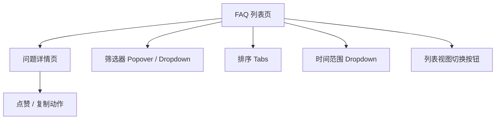

# FAQ 常见问答集 - UX / UI 规范

> 版本：v1.0  
> 作者：产品经理  
> 更新时间：2024-07-25

---

## 1. 概述

本规范基于《FAQ 常见问答集》功能需求（见 `faq.md.ts`）与现有测试界面 `src/test/qa_collection/` 的交互设计，详细说明正式产品环境下 FAQ 模块在 **桌面端 / 移动端** 的用户体验、布局与交互行为。目标：

1. 保证检索效率 —— 用户 3 秒内定位到目标问题；
2. 降低操作成本 —— 筛选、排序 1-2 次点击完成；
3. 视觉一致性 —— 组件风格与全站统一（shadcn/ui + Tailwind 设计体系）。

---

## 2. 信息架构

---

## 3. FAQ 列表页（/faq）

| 区域 | 功能 | 组件 | 说明 |
|---|---|---|---|
| 0. 页面头部 | 标题、副标题 | `<h1> / 
` | 同 QA 测试页：渐变文字 + muted 描述 |
| 1. 搜索框 | 关键词检索问题/答案/标签 | `Input` + `Search` 图标 | `debounce 300 ms`，保持 10px 左内边距 ||
| 2. 筛选区 | 分类、机型、标签 | `DropdownMenu` / `Popover+Command` | 单列（移动）/多列（桌面）自适应网格 |
| 3. 排序 Tabs | 最新 / 最佳 / 关注排行 / 我的分享 | `Tabs` | 默认 `latest`；`my-share` 仅登录用户可见 |
| 4. 时间范围 | 本周 / 本月 / 本季度 / 本年 / 总排行 | `DropdownMenu` | 仅当排序 = `ranking` 时显示 |
| 5. 视图切换 | 列表 / 卡片 | `ToggleGroup` | 记忆用户上次选择（localStorage） |
| 6. 结果区域 | QuestionCard / ListItem | 自定义组件 | 每页 20 条，支持无限滚动（IntersectionObserver） |

### 3.1. 搜索交互
- 输入 >0 个字符即触发过滤，命中范围：**标题 + 内容 + 标签**。
- 高亮搜索词（黄色背景 20% 透明）。

### 3.2. 筛选器交互
- **分类→机型** 级联：变更分类时，机型自动重置为“全部机型”。
- 标签 Popover 采用 **单选**，未来可扩展多选；选中后自动收起。
- 每次筛选变化，顶部显示选中条件摘要（小 Badge 形式），并提供“一键清空”按钮。

### 3.3. 排序与时间范围
- 排序值存储在 URL Query（`?sort=best`），便于分享。
- 当排序设为 `ranking` 时，自动附加 `period` Query；页面刷新后应还原。

### 3.4. 列表 / 卡片视图
- **列表视图**：仅标题 + 指标（回复 / 浏览 / 点赞）。
- **卡片视图**：
  - 左：问题元数据（分类 / 机型 / 标签 Badge 组）。
  - 中：标题 + 内容前 300 字截断（多行省略）。
  - 右：指标与创建时间。
- Hover 效果：卡片阴影提升；列表行背景色加深。

### 3.5. 空状态 & 加载
- 无结果：`FileQuestion` 图标 + “未找到相关问题”提示。
- 加载骨架：`Skeleton` 组件，3 行。

### 3.6. 响应式
- `md` 以下：筛选器折叠为 **Bottom Sheet**（使用 `<Sheet>` 组件），通过“筛选”按钮唤起。
- 标题字号从 `text-3xl` → `text-xl`。

---

## 4. 问题详情页（/faq/[id]）

| 区域 | 内容 | 组件 | 细节 |
|---|---|---|---|
| 1. 面包屑 | FAQ → 分类 → 当前问题 | `Breadcrumb` | 便于返回列表 |
| 2. 问题标题 | title | `<h1>` | 最大行数 2 行，溢出省略 |
| 3. 元数据面板 | 分类 / 机型 / 标签 / 创建时间 / 浏览量 | `Badge` + 图标文本 | 左侧固定列 |
| 4. 操作栏 | 👍 点赞 / 📋 复制答案 | `Button` | 未登录用户点击👍弹出登录对话框 |
| 5. 答案区 | Markdown 渲染 | `react-markdown` | 支持代码块、高亮、复制按钮 |
| 6. 推荐问题 | 同标签 6 条 | `QuestionCard (mini)` | 侧边栏呈现 |

### 4.1. 交互细节
- 点赞：Optimistic 更新；失败回滚。
- 复制：调用 `navigator.clipboard.writeText()`，成功后 `Toast` 提示“已复制到剪贴板”。
- 浏览量：服务器累加，客户端展示实时数；防刷：同 IP 60s 内只计一次。

---

## 5. 辅助交互 & 可访问性

1. 所有交互元素添加 `aria-label`；Dropdown / Popover 支持键盘导航。
2. 色彩对比 ≥ WCAG 2.1 AA。
3. 组件焦点状态使用品牌主色阴影。

---

## 6. 性能

| 目标 | 指标 |
|---|---|
| 首屏渲染 | ≤ 1 s（缓存命中） |
| 搜索 / 筛选响应 | ≤ 300 ms |
| 列表滚动帧率 | ≥ 55 FPS |

采用：
- 客户端缓存（SWR）+ 分页 / Cursor 方式按需加载；
- 懒加载图片 / Markdown 渲染组件；
- 过滤计算使用 `useMemo`，避免重复渲染。

---

## 7. 未来扩展

1. **多标签选择**：切换标签过滤器到多选模式，UI 保持一致。
2. **问题分享**：新增“分享”按钮，复制短链到剪贴板。
3. **服务端排序**：当数据量 > 1 万条时，改用后端排序并返回分页结果。

---

## 8. 交付物

- 对应 UI 组件库新增 `FaqListPage`, `FaqDetailPage`, `QuestionCard` 等组件。
- Cypress / Playwright 脚本：
  - 搜索 → 查看详情 → 点赞 → 返回 列表。
  - 排行榜（本周）→ 列表为空 → 切换时间范围。
- Storybook 故事：各状态 Snapshot。

---

以上为 FAQ 模块的 UX / UI 界面规范，后续迭代优先遵循本文档，如需调整请在版本号后追加修订记录。 